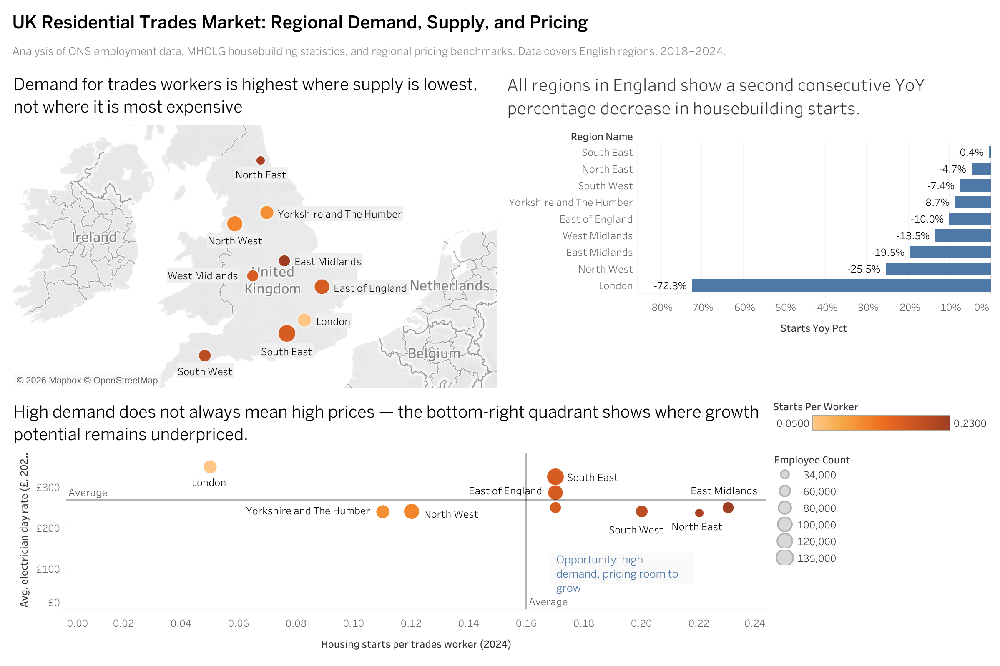

# UK Trades Market Analysis

## Overview

This project analyses the UK residential trades market to answer one business 
question: which regions show the strongest unmet demand for skilled tradespeople, 
and what do pricing patterns look like across those markets?

The analysis combines regional employment data, residential building permit 
activity, and trade pricing benchmarks to identify where demand is growing 
faster than supply, and where a platform connecting homeowners to tradespeople 
could build a competitive partner network.

## Background

During an internship at Adam Technology in Prague, I worked on expanding a 
partner network for electrical works across UK cities. Part of that role involved 
researching market regulations, competitive pricing, and regional demand. 
This project takes that hands-on context and builds a structured, data-driven 
version of that same analysis.

## Data Sources

- **ONS Labour Force Survey** — trades employment by UK region and year
- **GOV.UK Planning Portal** — residential building permit counts by region
- **Pricing benchmarks** — average electrician day rates by region, sourced 
  from Checkatrade and MyBuilder (manually compiled reference table)
- **ONS Geography Portal** — UK region reference table

All raw data files are stored in `/data/raw` and have not been modified from 
their original downloaded format.

## Tools

- **SQL (SQLite)** — schema design, data loading, and analytical queries
- **Tableau Public** — dashboard and visualisation
- **DBeaver** — database management and query interface

## Repository Structure

trades-market
├── data/raw          # Original downloaded datasets
├── sql/              # Schema and query files
├── tableau/          # Exported dashboard image
├── notes/            # Data source references and field notes
└── README.md

## Key Findings

- As of 2024, the East Midlands and North East show the highest ratio of 
  housing starts to available workers, signalling strong unmet demand.
- Housebuilding growth was positive across all English regions in 2021, but
  the demand has been on the decline. 2023 and 2024 saw negative YoY percentage
  changes in housebuilding starts in all English regions.
- High-demand regions do not consistently command the highest day rates, 
  suggesting pricing has not yet caught up with demand in those markets.

## Dashboard

[View interactive dashboard on Tableau Public](https://public.tableau.com/views/UKTradesMarketAnalysis/Dashboard?:language=en-GB&publish=yes&:sid=&:redirect=auth&:display_count=n&:origin=viz_share_link)